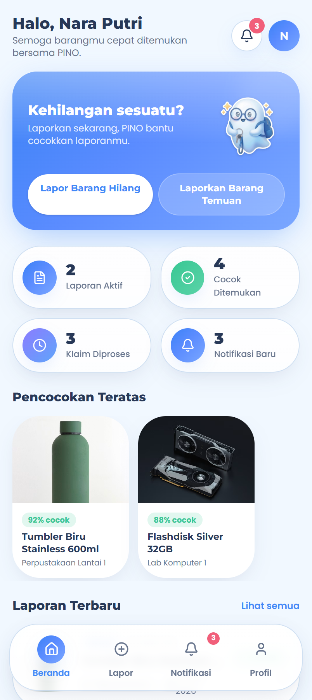

# SLFK — Campus Lost & Found

A campus lost-and-found system: report items you've lost or found, browse and claim them, and let campus security verify each hand-over. *Temukan. Klaim. Kembalikan.* — Find. Claim. Return.



## Overview

Lost-and-found on campus usually lives in a notebook at the security post. SLFK moves it into a phone-friendly app with three roles working together: students report and claim items, security guards (*satpam*) verify that a claimant really owns what they're picking up, and an admin keeps the whole catalogue in order.

## Roles

| Role | Can do |
|------|--------|
| **Student** (`mahasiswa`) | Report a lost or found item, browse the catalogue, and file a claim |
| **Security** (`satpam`) | Review incoming reports and verify claims before hand-over |
| **Admin** | Manage items, reports, and users across the system |

## Features

- Splash → login → role-aware home (students, security, and admins each land on their own dashboard)
- Report a **lost** item or a **found** item with details and contact info
- Browse the catalogue and open item detail pages
- File and track **claims**, with security verification before release
- Notifications and a personal profile
- Mobile-first UI with a friendly mascot (PINO)

## Demo accounts

The prototype seeds three accounts (password `12345678` for all):

| Role | Email |
|------|-------|
| Student | `nara@kampus.id` |
| Security | `satpam@kampus.id` |
| Admin | `admin@kampus.id` |

## Tech stack

- [TanStack Start](https://tanstack.com/start) with file-based routing and SSR
- React + TypeScript
- Tailwind CSS + shadcn/ui
- Client-side app store for auth and state

## Run locally

```bash
git clone https://github.com/GianneAngely/slfk-campus-connect.git
cd slfk-campus-connect
npm install
npm run dev
```

Then open the printed local URL and sign in with one of the demo accounts above.

## Note

Front-end prototype. Users, items, and claims are seeded mock data held in the browser, so the demo credentials above are intentional placeholders — there is no real backend or personal data.
